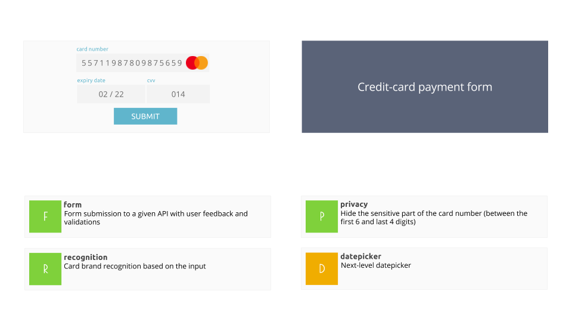

## Credit-Card Form

### Overview 



### Server

A simple server can be started on localhost:8000. The server expects JSON inputs and replies
with JSON outputs.

```
cd backend/
npm start
```

For credit-cards, the following endpoints are available:

Method | Path | Description
-------|------|------------
POST   | /transaction | submit a transaction's body (anything)
GET    | /cdn/payment_methods/mastercard.png | retrieve an HQ logo for Mastercard
GET    | /cdn/payment_methods/visa.png | retrieve an HQ logo for Visa

### Card validation

- Cvv is a 3-digit code
- Card pan starting with a `4` are Visa
- Card pan starting with `51`, `52`, `53` or `54` are Mastercard
- Other pans are rejected
- Extra: Luhn check

### Color Scheme

- #5a6378 | Dark blue
- #60b5cc | Light blue
- #7fd13b | Green
- #e74c3c | Red
- #f0ad00 | Orange
