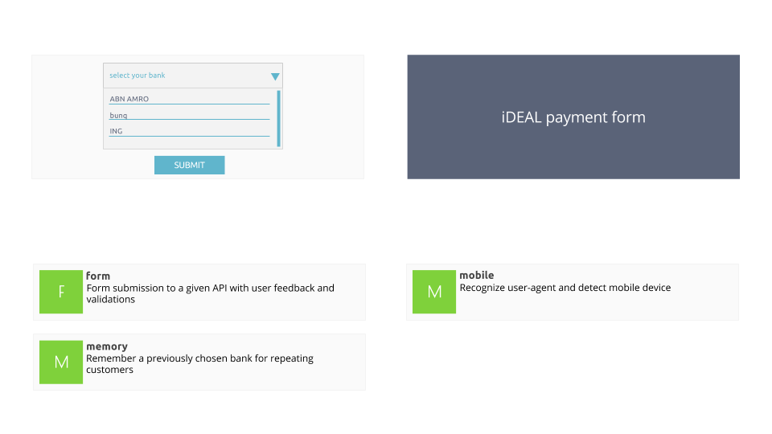

## Dynamic Bundles Loader

### Overview 



### Server

A simple server can be started on localhost:8000. The server expects JSON inputs and replies
with JSON outputs.

```
cd backend/
npm start
```

For the dynamic bundles loader, the following endpoints are available:

Method | Path | Description
-------|------|------------
GET    | /dist/1.js | retrieve a basic elm application (compiled)
GET    | /dist/2.js | retrieve another basic elm application (compiled)


### Color Scheme

- #5a6378 | Dark blue
- #60b5cc | Light blue
- #7fd13b | Green
- #e74c3c | Red
- #f0ad00 | Orange
