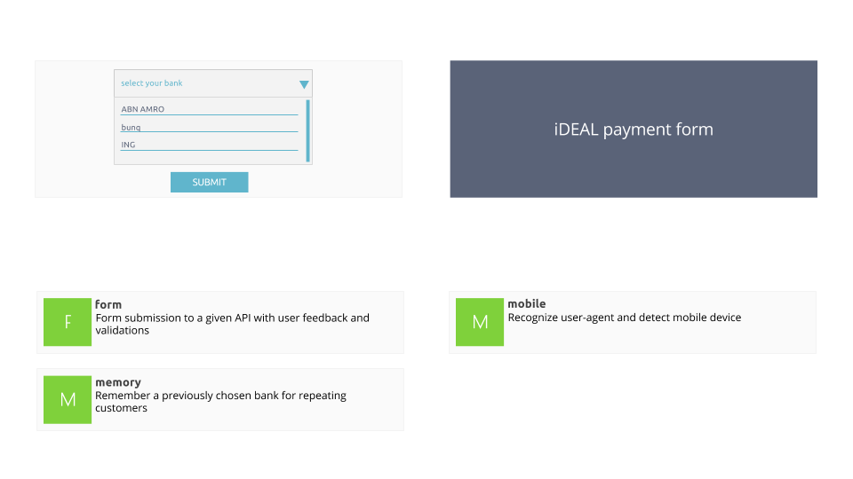

## iDEAL Payment Form

### Overview 



### Server

A simple server can be started on localhost:8000. The server expects JSON inputs and replies
with JSON outputs.

```
cd backend/
npm start
```

For iDEAL, the following endpoints are available:

Method | Path | Description
-------|------|------------
POST   | /transaction | submit a transaction's body (anything)
GET    | /cdn/payment_methods/ideal.png | retrieve a HQ logo for iDEAL

### Banks supporting iDEAL in the Netherlands 

iDEAL Identifier | Name
-----------------|-------
ABNANL2A | ABN Amro
ASNBNL21 | ASN Bank
BUNQNL2A | Bunq
FVLBNL22 | Van Lanschot Bankiers
INGBNL2A | ING
KNABNL2H | Knab
RABONL2U | Rabobank
RBRBNL21 | RegioBank
SNSBNL2A | SNS Bank
TRIONL2U | Triodos Bank

### Color Scheme

- #5a6378 | Dark blue
- #60b5cc | Light blue
- #7fd13b | Green
- #e74c3c | Red
- #f0ad00 | Orange
