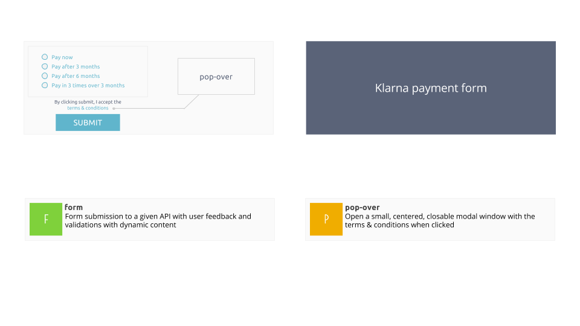

## Klarna Payment Form

### Overview 



### Server

A simple server can be started on localhost:8000. The server expects JSON inputs and replies
with JSON outputs.

```
cd backend/
npm start
```

For Klarna, the following endpoints are available:

Method | Path | Description
-------|------|------------
POST   | /transaction | submit a transaction's body (anything)
GET    | /cdn/payment_methods/klarna.png | retrieve a HQ logo for Klarna
GET    | /cdn/:country/payment_plan | retrieve a payment plan for a country (DK, NL or NO)
GET    | /cdn/terms/dk.txt | Danish terms and conditions
GET    | /cdn/terms/nl.txt | Dutch terms and conditions
GET    | /cdn/terms/no.txt | Norwegian terms and conditions

### Payment Plans

Klarna supports various payment plans depending on each countries & merchants. To simplify, we
consider simple plan that can have one or both properties:

- delay: The payment will be done after `delay` months
- number: The payment will be done in `number` of payments (once every month)

We'll also consider that an "instant payment" option is always available


### Color Scheme

- #5a6378 | Dark blue
- #60b5cc | Light blue
- #7fd13b | Green
- #e74c3c | Red
- #f0ad00 | Orange
